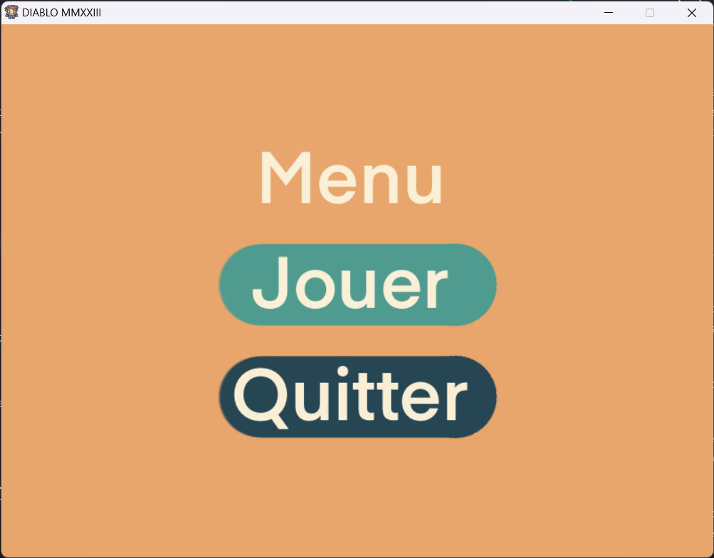
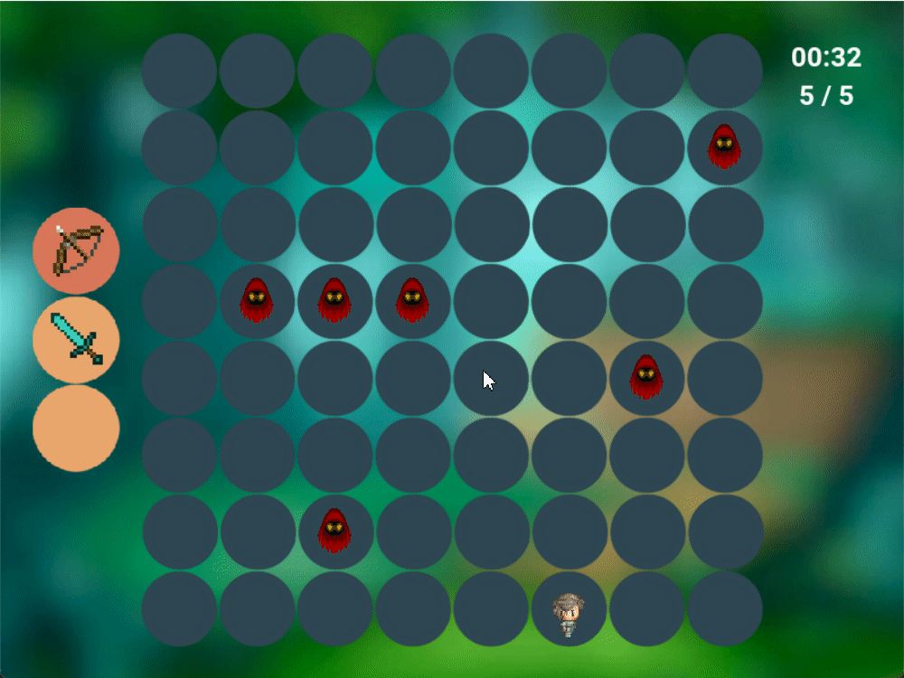

## Jeu en C
Ce projet a été réalisé dans le cadre du cours de méthodologie de la conception et de la programmation partie I pour les étudiants de la Licence 1 M-I-SPI de l'Université de Lorraine. Il consiste à créer un jeu solo qui se joue sur un plateau carré.

## Règles du jeu
Le but du jeu est de finir le plus vite possible les 5 manches.
Le joueur se déplace sur une carte carrée de taille 8x8 a l'aide des touches suivante :
- z : haut
- q : gauche
- s : bas
- d : droite

Le joueur peut attaquer les monstres qui sont sur la même case que lui si il a une arme à courte portée (ex : épee). Mais le joueur a aussi la possibilité d'utiliser un arc en tirant avec les touches directionnelles.
Le joueur peut changer d'arme grace à l'inventaire qui se trouve à gauche de la carte en mettant l'arme qu'il souhaite utiliser dans la case le plus en haut.

## Images du jeu
### Menu

    

### Inventaire, arme et deplacement

    

### Fin du jeu et attaque

    

## Les ameliorations :
### Inventaire :
Nous avons implémentés un nouveau module inventaire qui permet au joueur de changer d'arme en mettant l'arme qu'il souhaite utiliser dans la case le plus en haut de l'inventaire.
### Armes :
Nous avons implémentés un arc qui permet au joueur de tirer sur les monstres à distance. Pour tirer, il faut utiliser les touches directionnelles.

### Monstres :
Les monstres se déplacent aléatoirement sur la carte.
Si nous sommes sur la meme case qu'un monstre avec une arme à courte portée, une barre de vie est affiché, pareil si nous avons une arme a longue distance et qu'un monstre est à portée de tir.

### Interface :
Nous avons implémentés une interface graphique en SDL qui permet de jouer au jeu.
Nous avons aussi implémentés un menu qui permet de choisir entre jouer au jeu ou quitter le jeu.

### Sons :
Nous avons implémentés des sons pour le jeu. Il y a un son pour chaque action du joueur (tirer avec l'arc, mort d'un monstre, musique de fond).
Nous avons utilisé la librairie SDL_mixer pour jouer les sons.

### Hud :
Nous avons implémentés un hud qui permet d'afficher un chrono et le nombre de manche restante. 
Nous avons utilisé la librairie SDL_ttf pour afficher le texte.

### Sauvegarde du temps :
Nous avons implémentés une sauvegarde du temps du joueur. Le temps est sauvegardé dans un fichier texte. Le temps est affiché dans l'hud.

## Comment utiliser le jeu
<strong> J'ai remarqué un probleme de compilation sur certaines machines si ca arrive démarrer le jeu avec la commande `./bin/start` directement </strong>

Pour utiliser le jeu, il faut tout d'abord cloner <a href="https://github.com/MMMatth/Jeu-TP3">le répertoire GitHub</a> sur votre machine. Pour cela, il faut copier l'URL du répertoire depuis GitHub et lancer la commande git clone dans un terminal en utilisant l'URL copiée.

Ensuite, pour lancer le jeu, il faut compiler le programme en utilisant la commande ./compil dans le terminal. Cette commande va compiler tous les fichiers sources nécessaires au fonctionnement du jeu et créer un exécutable nommé "start dans le dossier bin".

Pour lancer le jeu, il suffit d'exécuter le fichier "start" en utilisant la commande "./bin/start" dans le terminal.
